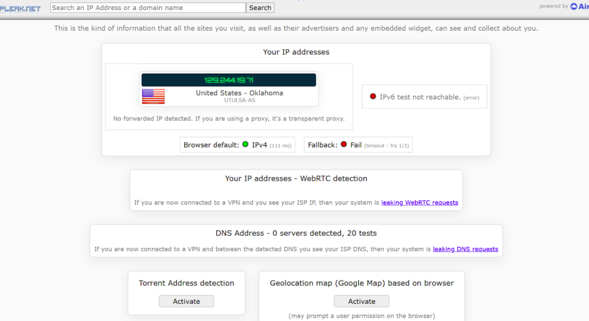

# Project 3 \- Wireguard Docker Container

## **Create a Digital Ocean account**

## **Create a Droplet in DigitalOcean**

1. Use this link to [DigitalOcean.com](https://m.do.co/c/d33d59113ab6) to sign up with your school email and Agent Miller’s credit card  
2. Choose the lowest price tier \- $6 per month  
3. Create an Ubuntu droplet  
4. Select all of the basic options  
5. Choose password instead of ssh key \- *We chose TulsaTime@1865edu*  
6. Name the project \- *Reccomend something simple like: Wireguard project*  
7. Droplet IP \- *had 64.23.171.188*

**Install Wireguard** 

1. SSH into the droplet by opening a terminal and typing ssh root@\[ip\]  
   1. Where you would replace \[ip\] with the IP of your DigitalOcean Droplet  
2. Install the dependencies/packages needed to run docker. Commands: `sudo apt install docker`, `sudo apt install docker-compose`, `sudo apt install wireguard`  
3. **Set up Wireguard using Docker Compose**:   
1. Create a directory for Wireguard: 

`mkdir \-p /opt/wireguard`  
`cd /opt/wireguard`  
 

2. Create a docker-compose.yml file: 

`nano docker-compose.yml`
 

3. Add the following configuration to docker-compose.yml: 


```

**yaml**  **docker-compose.yml**  
  GNU nano 8.1                                                          
version: '3.8'  
services:  
  wireguard:  
    container\_name: wireguard  
    image: linuxserver/wireguard  
    environment:  
      \- PUID=1000  
      \- PGID=1000  
      \- TZ=American/New\_York  
      \- SERVERURL=45.55.41.235  
      \- SERVERPORT=51820  
      \- PEERS=pc1,pc2,phone1  
      \- PEERDNS=auto  
      \- INTERNAL\_SUBNET=10.0.0.0  
    ports:  
      \- 51820:51820/udp  
    volumes:  
      \- type: bind  
        source: ./config/  
        target: /config/  
      \- type: bind  
        source: /lib/modules  
        target: /lib/modules  
    restart: always  
    cap\_add:  
      \- NET\_ADMIN  
      \- SYS\_MODULE  
    sysctls:  
      \- net.ipv4.conf.all.src\_valid\_mark=1

```


4. Save and exit.   
     
2. **Run Wireguard**: 

`docker-compose up \-d`
 

3. **Check logs to get the QR code**: 

docker logs wireguard 

**Test Your VPN** 

***Mobile Device*** 

1. Open the Wireguard app and scan the QR code from the logs.   
2. **Before connecting**:   
1. Visit [IPLeak.net](https://ipleak.net/) and screenshot your local IP.   
3. **After connecting**:   
1. Turn on the Wireguard VPN and revisit IPLeak.net.   
2. Screenshot the VPN IP to confirm it is active. 

***Laptop*** 

1. Find the configuration file: 

`ls /opt/wireguard/config`   
 

2. Copy the .conf file to your laptop. 

   In our case the .conf file contained:

   
```
   \[Interface\]

   PrivateKey \= iLwC8xbCzwVd5j9s7Et/72d6keAAVTlkmxcY/wX6Ako=

   ListenPort \= 518

   .20

   Address \= 10.0.0.2/32

   DNS \= 10.0.0.1

   

   \[Peer\]

   PublicKey \= P5GnsQQZk4X0KilGkKNg5ND/XZjV0KP7QDNuShSCcG4=

   PresharedKey \= 5X6AWptfcPEHqhgi3nVlEb6vx833rLQic/ofI4TMy5s=

   AllowedIPs \= 0.0.0.0/0, ::/0

   Endpoint \= 45.55.41.235:51820
  ```

   

   

3. Import the file into the Wireguard app or CLI.   
4. Follow the same steps as mobile to confirm functionality using IPLeak.net. 

 

 

Screenshots:  



 


Documentation Completed by:   
Ethan Belanger  
Jalen Brown  
Talha Choudhury  
Levi Dunsmore  
Haleigh Harris  
Elise Hill  
Oliver Johnson  
Braden Lavarnway  
Steven Lu  
Nolan Miller  
Kinlee Null  
James Oakes  
Devin Pattison  
Ben Pikul  
Anastasia Reed  
Ahmed Al Shaqsi  
Ahmad Sher  
Jacob Silberfarb  
Saniya Singh  
Kenji Tratnik  
Philip Tu  
Alex Watson  
Nuraiym Zhusupbekova
